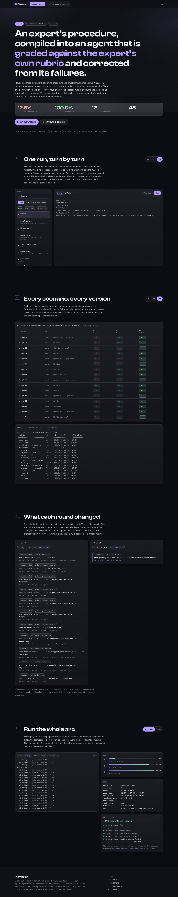
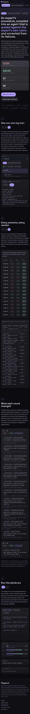

# Browser demo

A static page that runs the Playbook offline pipeline in the browser: ingest, prompt versions,
the tool-calling loop, the rubric grader and the correction loop. No backend, no API calls, no
API key; the fonts are served with the page from `public/fonts`, so a loaded page makes no
cross-origin request. Vite, React 18 and TypeScript in strict mode.

The procedures the page runs are the ones under `../procedures` in the repository root, read at
build time through the `@procedures` alias in `vite.config.ts`; `scripts/selfcheck.node.ts` reads
the same directory. There is no copy under `src/` to keep in sync, which also means a hosted build
needs the repository root available, not only `web/`. The rubrics and scenario sets are parsed
from YAML by a small plugin in `vite.config.ts`, so the page ships JSON and the only runtime
dependencies are React and React DOM.

`src/sim/` is a port of the Python offline path, module for module:

| module | ports |
|---|---|
| `ingest.ts` | `playbook/ingest`: SOP and walkthrough parsing with citations |
| `prompt.ts` | `playbook/agent/prompt.py`: versioned `PromptSpec` rendering and correction merging |
| `engine.ts` | `fakes/model_server.py`: the deterministic stand-in and its rule grammar |
| `tools.ts` | `fakes/jira_server.py`, `fakes/slack_server.py` and the knowledge base |
| `loop.ts` | `playbook/agent/loop.py`: the bounded tool loop and the run trace |
| `grader.ts`, `scenarios.ts` | `playbook/evals`: rubrics, scenario sets, criteria and the offline judge |
| `corrections.ts`, `feedback.ts` | `playbook/feedback`: correction derivation and the improvement loop |
| `report.ts` | `playbook/evals/report.py`, including the way Python rounds a percentage |
| `arc.ts` | the whole run for one procedure, plus the summary block |

The simulation is deterministic: ids and simulated latencies come from a seeded PRNG
(`prng.ts`), there is no `Math.random`, no wall-clock time and no `eval`, and the self-check
asserts all three by scanning the modules.

## Commands

```
npm install
npm run dev         # local dev server
npm run typecheck   # tsc with no emit
npm run build       # type-check and produce dist/, the command Vercel runs
npm run selfcheck   # 51 assertions in node, exits non-zero on any failure
npm run smoke       # serve dist/, drive it in Chrome, write docs/desktop.png and docs/mobile.png
npm run preview     # serve dist/
```

`npm run selfcheck` reproduces the measured results in the repository README: support triage
12.5% -> 87.5% -> 100.0% over three prompt versions with 12 corrections, incident communications
12.5% -> 100.0% with 6, and asserts that the same seed produces an identical summary while a
different seed changes run ids without changing a single grade. It also checks the percent
formatting against `src/fixtures/pct-cases.ts`, a table of values and the output Python's
`f"{x * 100:.1f}%"` gives for them, written by `scripts/pct-cases.py` in the repository root. The
page runs the same assertions except the three that scan the module sources, so it reports 48.

`npm run smoke` serves `dist/` with `vite preview` and drives it in the Chrome installed on the
machine through playwright-core: it fails on a console error, a page error, a request to any other
origin, horizontal overflow at 1440 or 390 px, or a self-check that does not come back green, and
it writes `docs/desktop.png` and `docs/mobile.png`. The two committed screenshots are that output,
recompressed losslessly, so running the test again leaves a diff of the same picture.

## Sections

1. **One run, turn by turn** steps through a single scenario's trace: intake, each model turn with
   its stop reason and token counts, each tool call with its arguments and the JSON returned. Its
   second rail tab lists what the stand-in parsed out of that version's prompt: every rule with
   its condition, the step it belongs to and the correction that added it, then the prose the
   stand-in ignored.
2. **Every scenario, every version** grades the whole set against every prompt version, red to
   green, with the before and after table the CLI prints.
3. **What each round changed** lists the corrections a round derived, the SOP step each was
   appended to, the criterion that failed and the scenarios that produced it.
4. **Run the whole arc** replays the loop's log, then prints the summary block and the self-check
   result.

## Fonts

`public/fonts` holds the latin subset of Space Grotesk as a single variable face (weight axis 300
to 700, the display face) and the latin subset of JetBrains Mono 400, 500 and 600. Both are under
the SIL Open Font License 1.1 and each ships the license text next to the files, in
`public/fonts/OFL-SpaceGrotesk.txt` and `public/fonts/OFL-JetBrainsMono.txt`. A font whose license
does not allow redistribution cannot be committed here, however freely it may be used on a site:
it would have to be loaded from the vendor, which the page's no-cross-origin-request guarantee
rules out.

## Continuous integration

The `web` job in `.github/workflows/ci.yml` runs `npm ci`, `npm run typecheck`,
`npm run selfcheck`, `npm run build` and `npm run smoke` on the Node major pinned in `.nvmrc`,
using the Google Chrome the runner image ships.

## Deployment

`vercel.json` builds with `npm run build` into `dist/`. The page is entirely static.

## Screenshots




